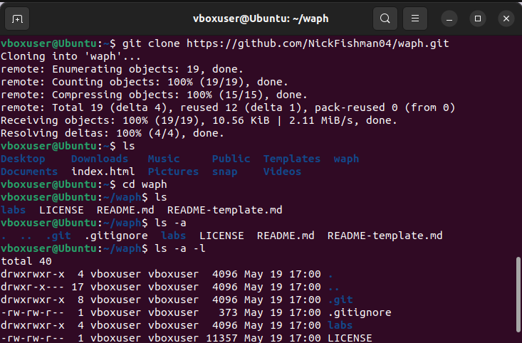

# waph

Public Respository for Web Application Programming and Hacking course - Dr. Phu Phung

# WAPH-Web Application Programming and Hacking

## Instructor: Dr. Phu Phung

## Student

**Name**: Nick Fishman

**Email**: [fishmane@mail.uc.edu](fishmane@mail.uc.edu)

**Short-bio**: Nick Fishman is an electrical engineering student with a specific interest in hardware and circuits. 

## Repository Information

Respository's URL: [https://github.com/NickFishman04/waph.git](https://github.com/NickFishman04/waph.git)

This is a private repository for Nick Fishman to store all code from the course. The organization of this repository is as follows.

### Lab 0

Lab 0 Part 1:

1: Downloaded the VirtualBox application onto my computer from https://www.virtualbox.org/wiki/Downloads
2: Downloaded the ISO file for Ubuntu 22.04.5 from http://linuxconfig.org/ubuntu-22-04-download
3: Set up the virtual machine in VirtualBox, allocating a modest amount of system resources to it.
4: Installed Google Chrome from google.com/chrome in the preinstalled Firefox browser.
5: Installed Apache2, git, and sublime-text --classic onto the virtual machine.
6: Installed Pandoc and subsidiary systems with the commands specified in the lecture.

Lab 0 Part 2:

Git creation
Go to GitHub, click New repository, name it, and make sure you choose Private instead of Public. Add a README if needed, then click Create repository. After that, copy the repo link so you can clone it to your VM later.

Exercises
During the hands-on exercises, I generated SSH keys and added the public key to my GitHub account so my VM could securely connect to GitHub. I then cloned my remote repository into the VM, which allowed me to work with the project files locally. After cloning the repository, I edited the README.md file using the provided template and added my headshot to personalize the page. These steps helped me practice using SSH, GitHub, the command line, and basic repository editing in a real development environment.

### Labs 

[Hands-on exercises in lectures](labs) 

  - [Lab 0](labs/lab0): Development Environment Setup 

### Hackations

Hands-on hacking exercises

### Individual Projects

### Team Project
