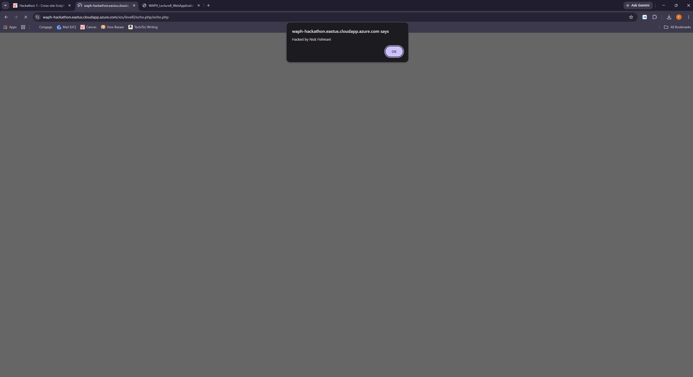
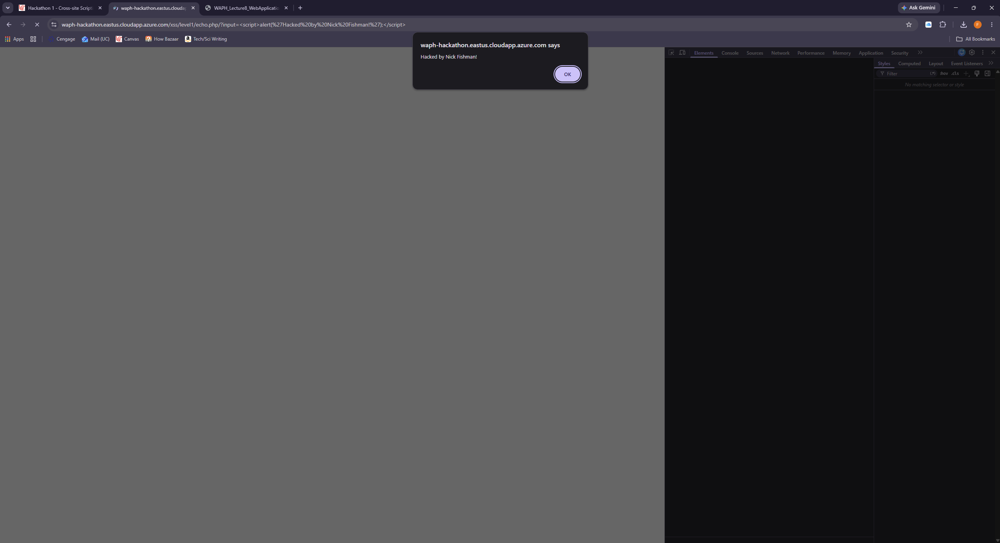
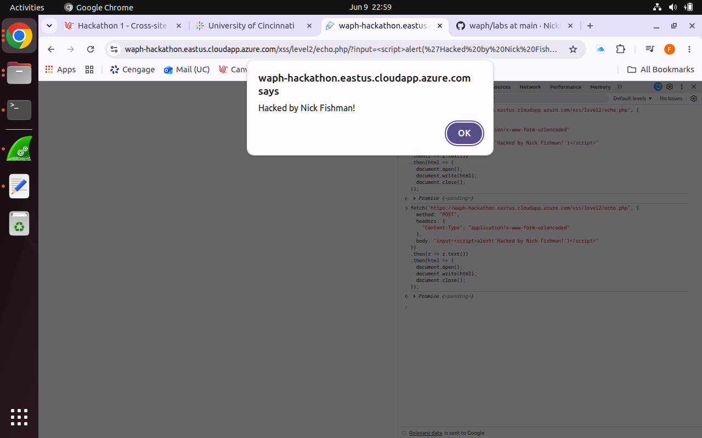
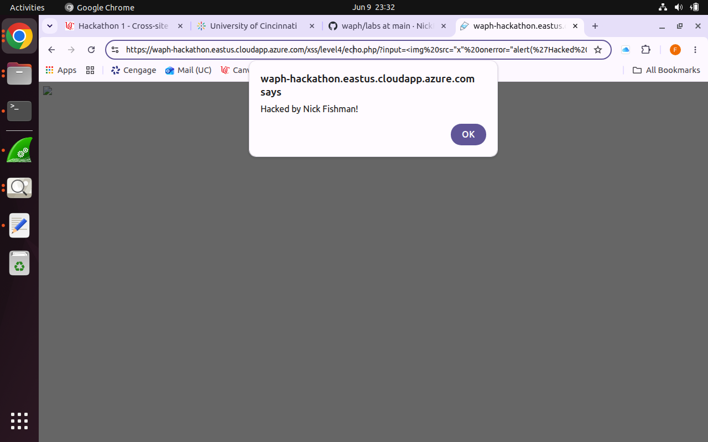
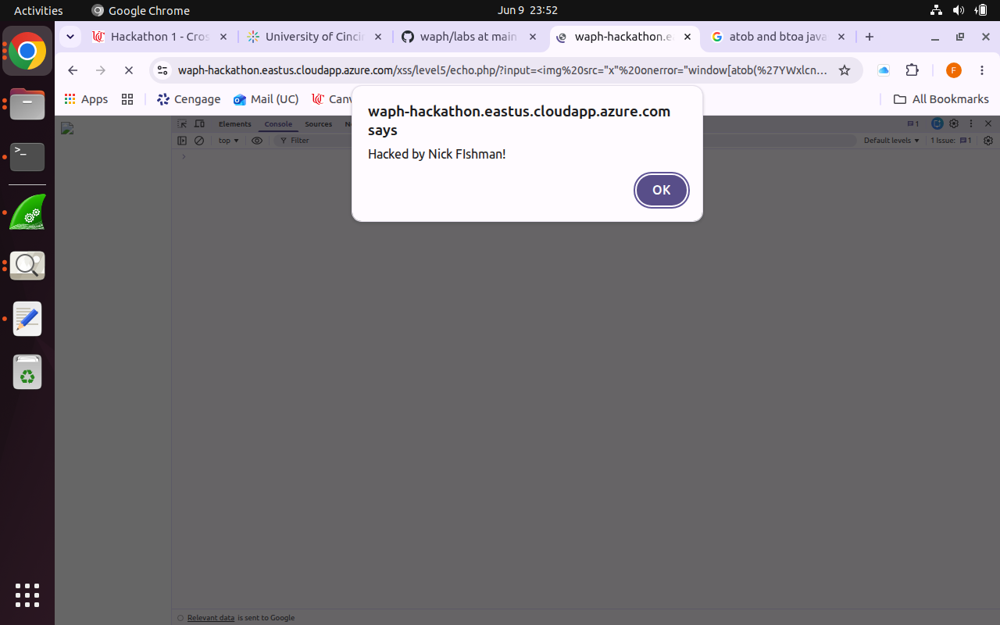
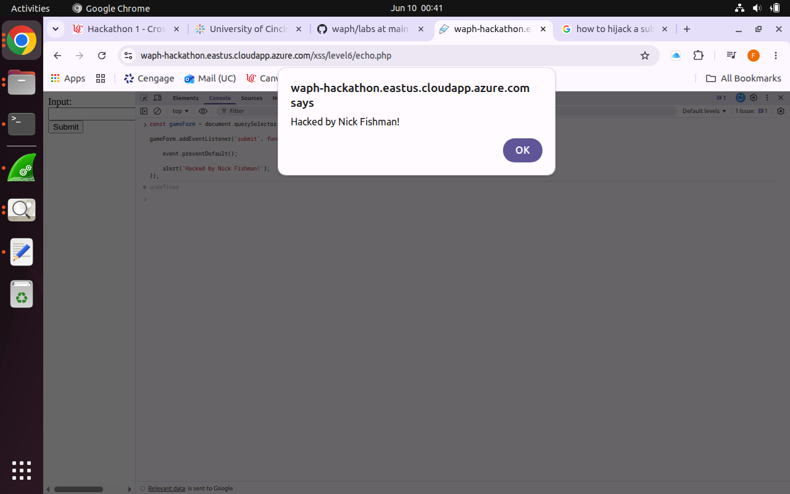
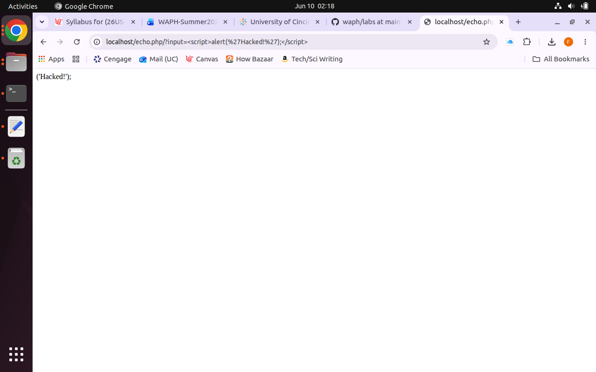

# waph

Public Respository for Web Application Programming and Hacking course - Dr. Phu Phung

# WAPH-Web Application Programming and Hacking

## Instructor: Dr. Phu Phung

## Student

**Name**: Nick Fishman

**Email**: [fishmane@mail.uc.edu](fishmane@mail.uc.edu)

**Short-bio**: Nick Fishman is an electrical engineering student with a specific interest in hardware and circuits. 

## Repository Information

Respository's URL: [https://github.com/NickFishman04/waph.git](https://github.com/NickFishman04/waph.git)

This is a private repository for Nick Fishman to store all code from the course. The organization of this repository is as follows.

### Hackathon 1

Task 1. Attacks: (35 pts) 7 level of reflected cross-site scripting attacks on ​
https://waph-hackathon.eastus.cloudapp.azure.com/xssLinks to an external site. ​

Code guess (lvl2):

<?php
echo $_POST["input"];
?>

Code guess (lvl3):

<?php
$input = $_GET['input'];
$input = str_replace(
    [''],
    '',
    $input
);
echo $input;
?>

Code guess (lvl4):

<?php
$input = $_GET['input'];
$input = str_replace(
    [''],
    '',
    $input
);
echo $input;
?>

(converted "alert" to binary and back to ascii to get around filter)
Code guess (lvl5):

<?php
$input = $_GET['input'];

$input = preg_replace('/<\/?script[^>]*>/i', '', $input);
$input = str_ireplace('alert', '', $input);
if (stripos($input, 'alert') !== false) {
    echo json_encode(["error" => "No 'alert' is allowed!"]);
    exit;
}

echo $input;
?>

Code guess (lvl6):

<?php

$userInput = $_POST['input'];

echo "";
?>

Task 2. Defenses: (15 pts) Review your code and implement input validation and XSS defense methods​

Used AI to clean up/debug code.

<?php

$input = $_REQUEST['input'];

$input = preg_replace('/<\/?script[^>]*>/i', '', $input);
$input = str_ireplace('alert', '', $input);

if (stripos($input, 'alert') !== false) {
    echo json_encode(["error" => "No 'alert' is allowed!"]);
    exit;
}

echo $input;

?>

### Labs 

[Hands-on exercises in lectures](labs) 

  - [Lab 0](labs/lab0): Development Environment Setup 
  - [Lab 1](labs/lab1): Foundations of the Web
  - [Lab 2](labs/lab2): Front-end Web Development

### Hackathons

  - [Hackathon 1](hackathons/hackathon1): Cross-site Scripting Attacks and Defenses 

### Individual Projects

### Team Project
