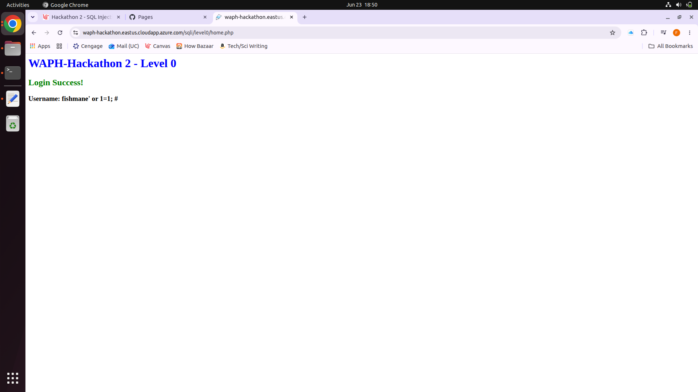
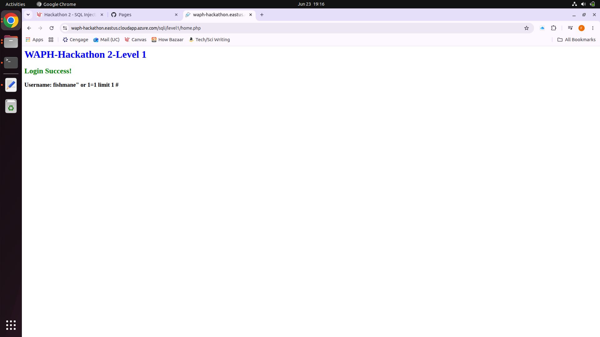
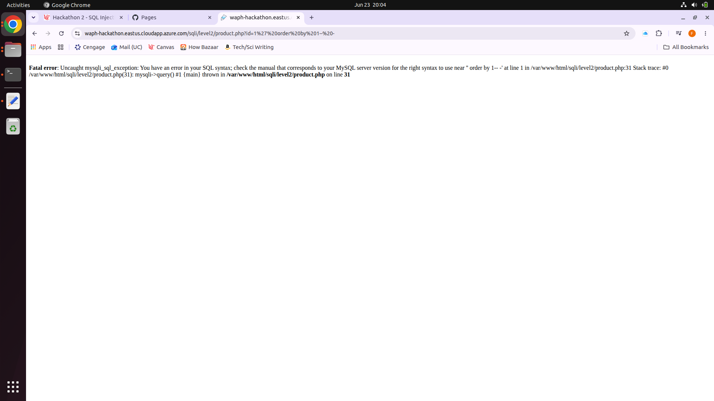
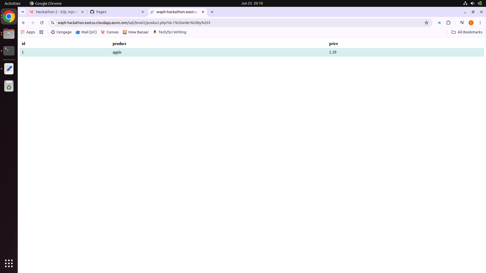
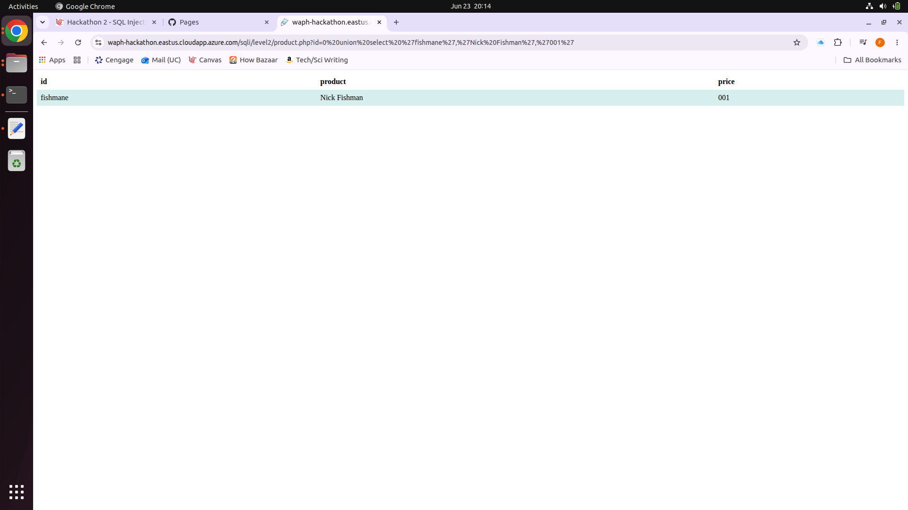
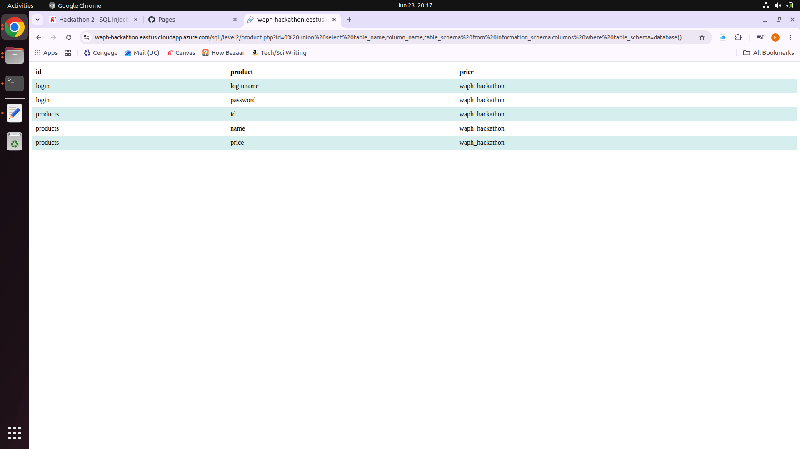
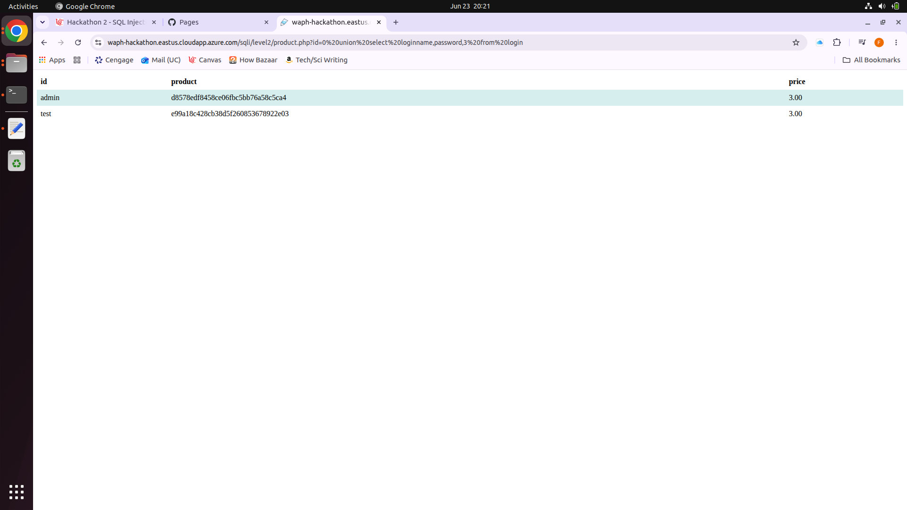
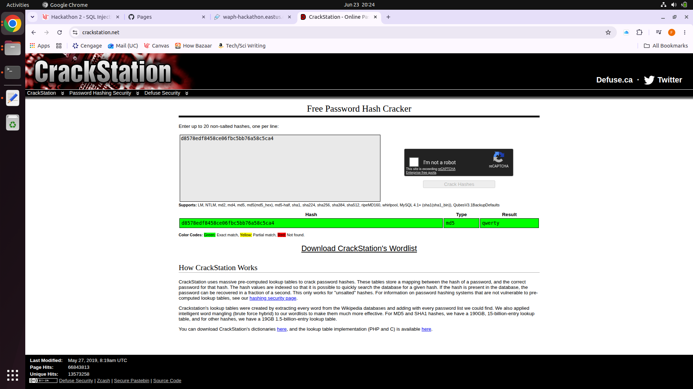
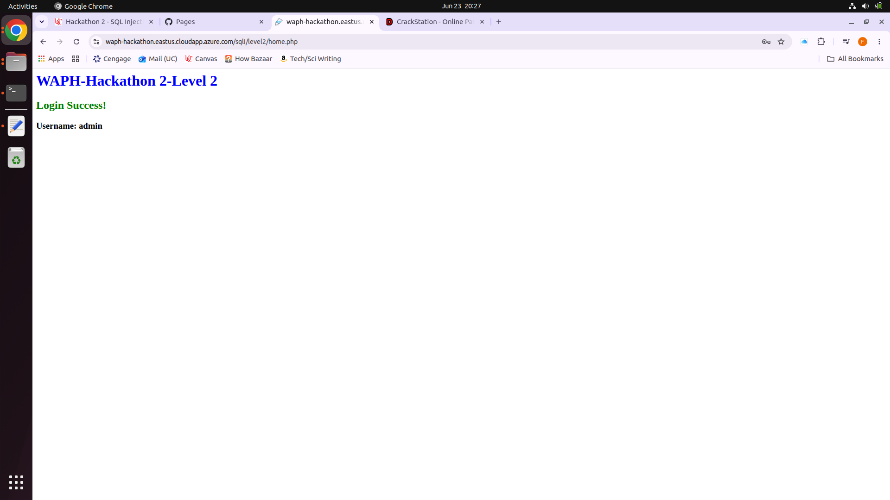

# waph

Public Respository for Web Application Programming and Hacking course - Dr. Phu Phung

# WAPH-Web Application Programming and Hacking

## Instructor: Dr. Phu Phung

## Student

**Name**: Nick Fishman

**Email**: [fishmane@mail.uc.edu](fishmane@mail.uc.edu)

**Short-bio**: Nick Fishman is an electrical engineering student with a specific interest in hardware and circuits. 

## Repository Information

Respository's URL: [https://github.com/NickFishman04/waph.git](https://github.com/NickFishman04/waph.git)

This is a private repository for Nick Fishman to store all code from the course. The organization of this repository is as follows.

## Hackathon 2

###Level 0:

###Level 1:

####Injection payload:

fishmane" or 1=1 limit 1 #

####Back-end SQL string:

SELECT * FROM users WHERE username = "$username" AND password = md5('$password')

###Level 2:

####Subtask a:

The product.php page takes an id parameter in the URL (product.php?id=1), which drives a database query to display product info (id, product, price).

If you append a single quote to the parameter, like so: product.php?id=1'
You get a fatal error, such as: Fatal error: Uncaught mysqli_sql_exception: You have an error in your SQL syntax... near ''' at line 1 in /var/www/html/sqli/level2/product.php:31

This proves there is a vulnerability because the inverted comma was inserted directly into the SQL query without sanitization. If it can get through, that means that an attack could very easily do so as well.

####Subtask b:

#####i)

There are 3 columns for apple, as evidence by the below screenshot.

#####ii)

#####iii)

#####iv)

The passwords are still in unsalted md5 format, so I cracked both hashes using an online MD5 lookup service (CrackStation). The below image shows qwerty cracked, and the other value turns out to be abc123.

####Subtask c:

### Labs 

[Hands-on exercises in lectures](labs) 

  - [Lab 0](labs/lab0): Development Environment Setup 
  - [Lab 1](labs/lab1): Foundations of the Web
  - [Lab 2](labs/lab2): Front-end Web Development

### Hackations

- [Hackathon 1](hackathons/hackathon1): Cross-site Scripting Attacks and Defenses 
- [Hackathon 2](hackathons/hackathon2): SQL Injection Attacks

### Individual Projects

- [Individual Project 1](projects/iproject1): Professional Profile Website and API Integration

### Team Project
