# WAPH-Web Application Programming and Hacking

## Instructor: Dr. Phu Phung

# Lab 1 - Foundations of the Web 

## The lab's overview

Lab 1 introduced how the web works at the protocol level and how simple server-side apps are built. I used Wireshark to inspect real HTTP traffic, used telnet and curl to send raw HTTP requests, and wrote small C CGI and PHP programs to see how GET and POST data are handled. By the end I understood how headers and request formats change server responses, how to capture and interpret HTTP packets, and the basic security considerations for echo-style web apps.

[https://github.com/NickFishman04/waph/blob/main/labs/lab1](https://github.com/NickFishman04/waph/blob/main/labs/lab1)

## Part I - The Web and HTTP Protocol

### Task 1. Familiar with the Wireshark tool and HTTP protocol

# Task 1 Summary: 
I used Wireshark to capture network traffic while opening webpages in a browser. Then, I filtered the packets using HTTP to see the requests and responses between the client and server.

# Task 1 Screenshots:
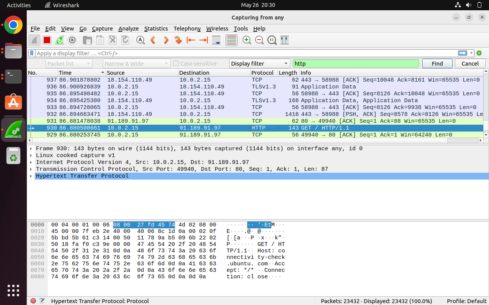
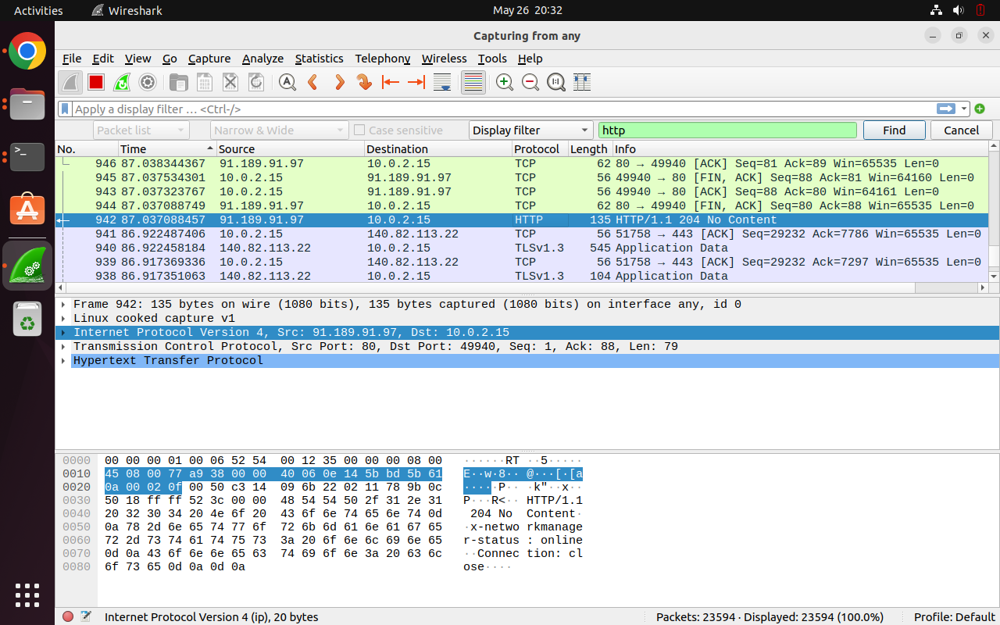
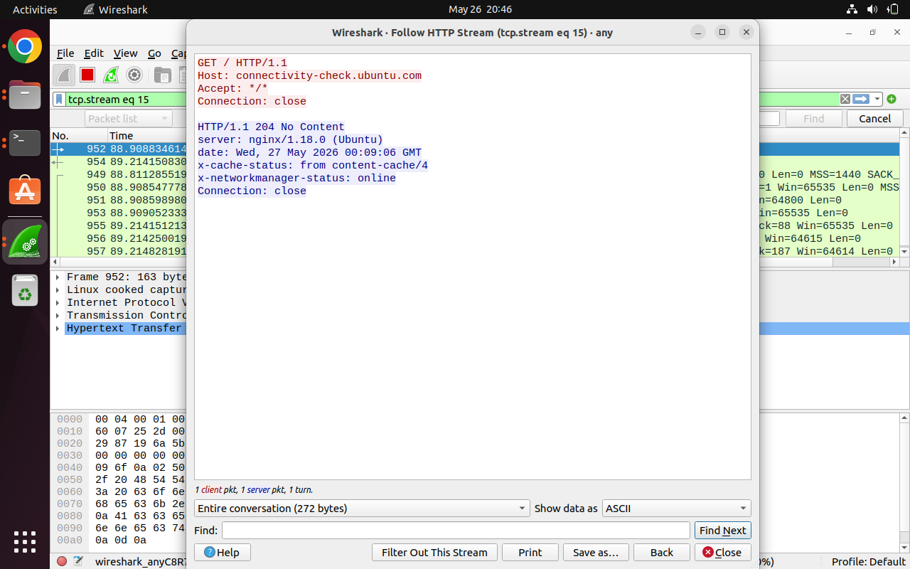

### Task 2. Understanding HTTP using telnet and Wireshark

  I captured network traffic in Wireshark, opened telnet to the server, and sent a minimal HTTP request (GET /). I viewed the server response in the terminal. Wireshark showed the telnet request had far fewer headers than a browser request.
  
  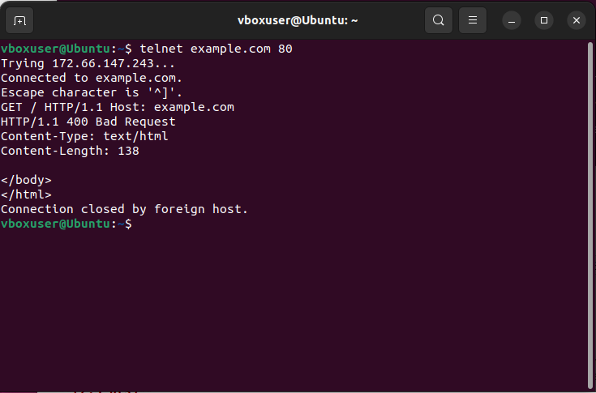
  
  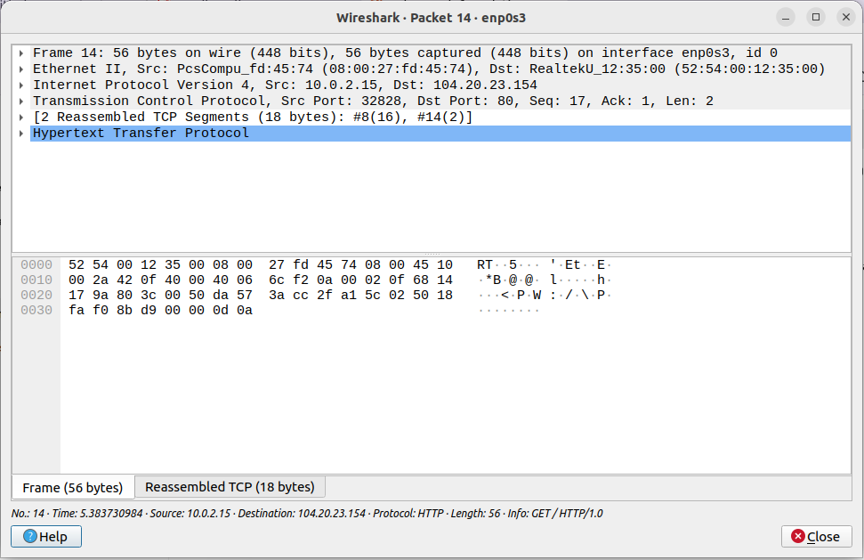
  The difference is that the telnet request is minimal and lacks most of the headers a browser sends.

  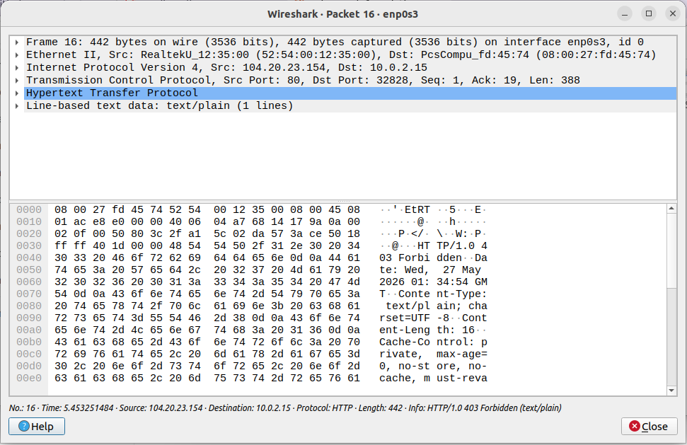
  Sometimes. Often the status and body match, but the telnet response can differ because the telnet request lacks browser headers.

## Part II - Basic Web Application Programming

###   Task 1. (10 pts) CGI Web applications in C

   I wrote a C program that prints HTTP headers and HTML, compiled it with gcc, placed the executable in the server's cgi-bin, enabled CGI in Apache, and verified it by opening the CGI URL in a browser.
   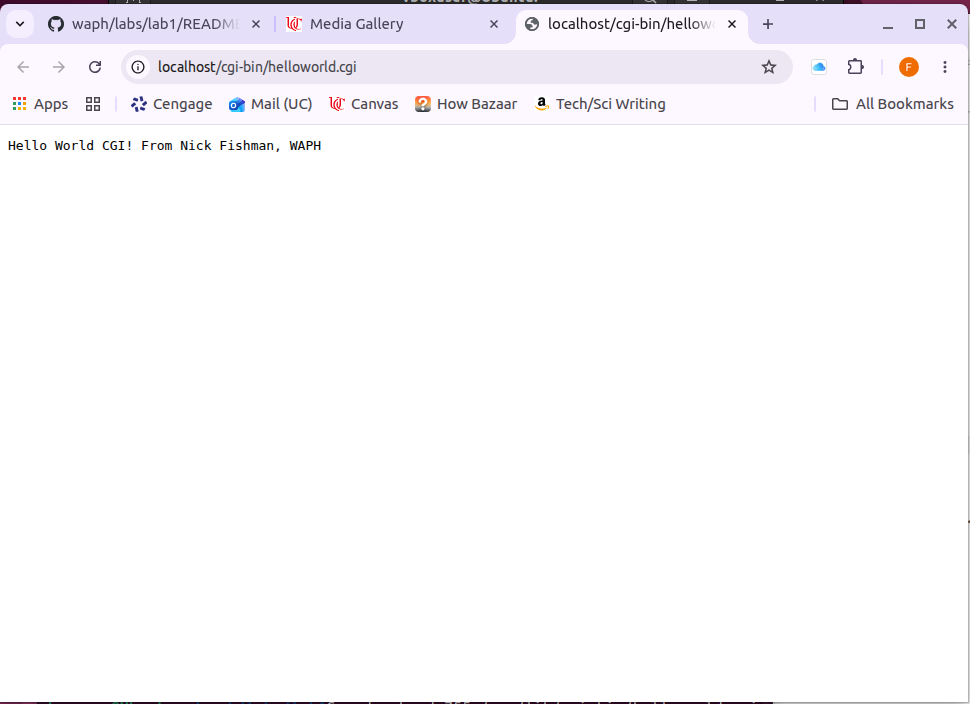
   
   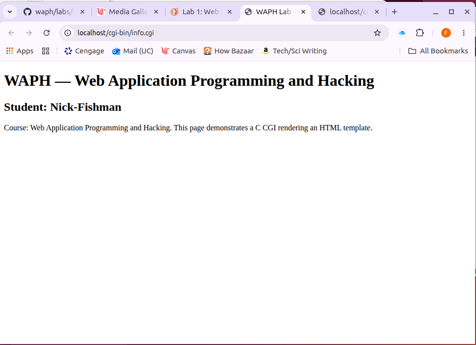
   Source code:
   #include <stdio.h>

int main(void) {
  printf("Content-Type: text/html; charset=utf-8");
  printf("<!doctype html><html><head><meta charset=\"utf-8\"><title>WAPH Lab - Info</title></head><body>");
  printf("<h1>WAPH — Web Application Programming and Hacking</h1>");
  printf("<h2>Student: Nick-Fishman</h2>");
  printf("
Course: Web Application Programming and Hacking. This page demonstrates a C CGI rendering an HTML template.
");
  printf("</body></html>
");
  return 0;
}

###  Task 2 (10 pts). A simple PHP Web Application with user input.

   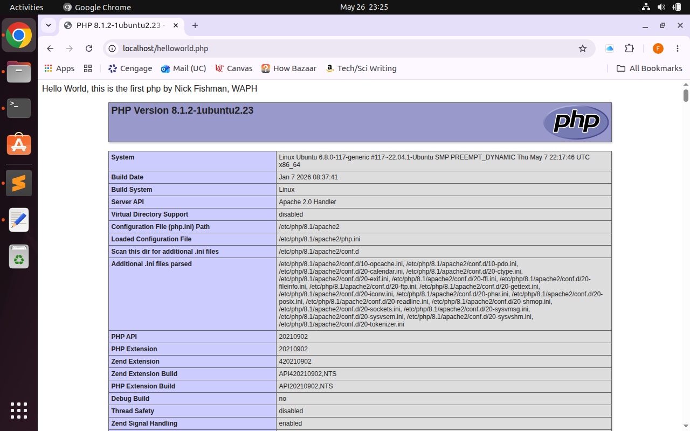

b. Demonstrate that you developed and deployed an echo Web application in PHP, e.g., `echo.php` with a screenshot with your name in the data **(2.5 pts)**. Include the source code of the file in the report and discuss if there are any security risks in this simple web application. **(5 pts)**

If I use the below script in the data portion of the query, I can hijack the text field for my personal script.
http://localhost/echo.php?data=%3Cscript%3Ealert(%27Hacked%27);%3C/script%3E

   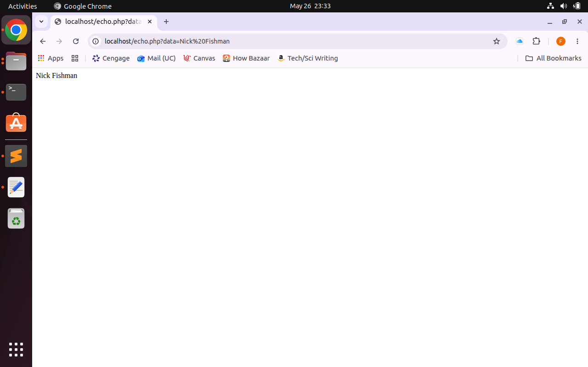

<?php

	echo $_REQUEST["data"];
?>

### Task 3 (10 pts). Understanding HTTP GET and POST requests.

   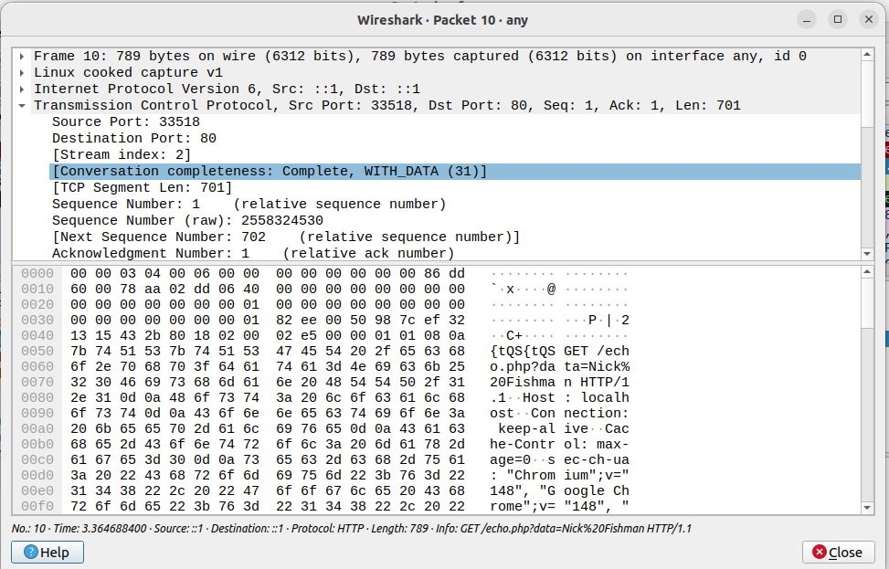

   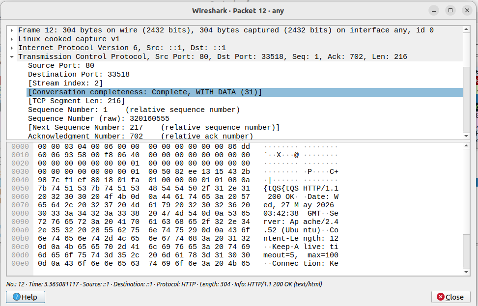

   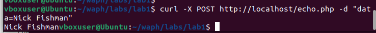
   
   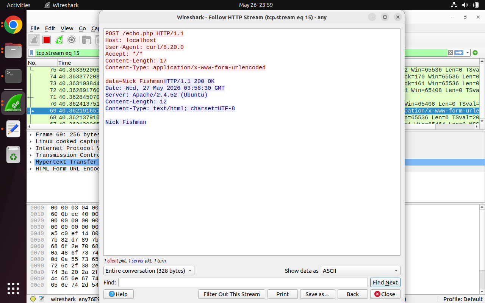

While the two are identical in outcome, in the get version, the data was a part of the address, while in the post version, it is a part of the metadata. The responses are exactly the same.
