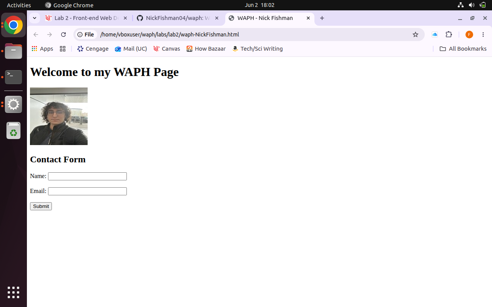
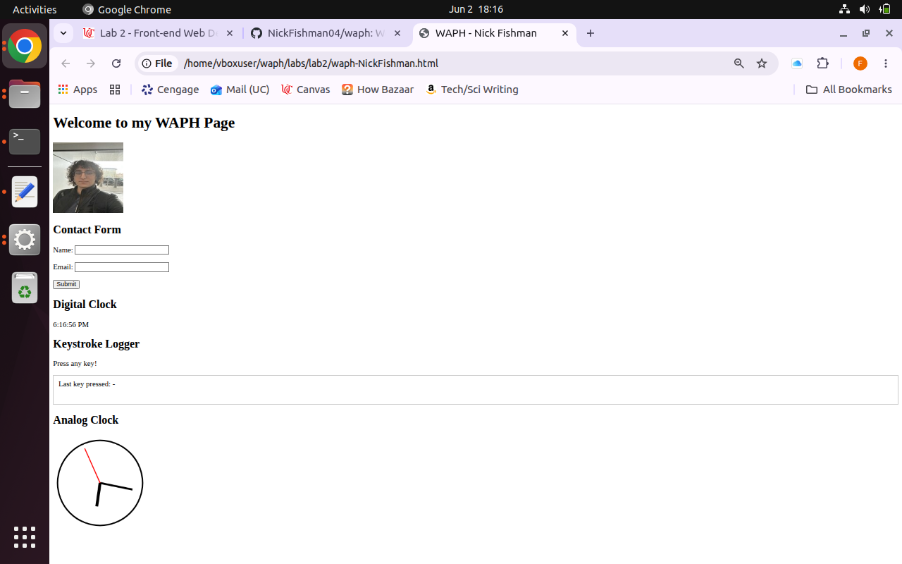
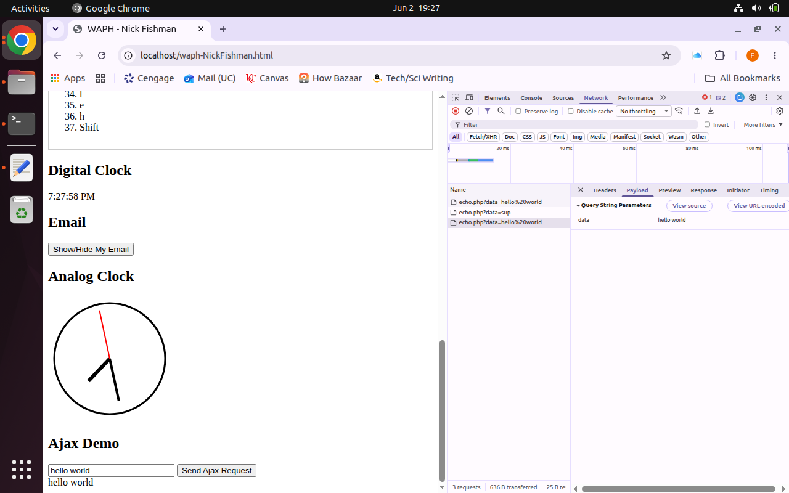
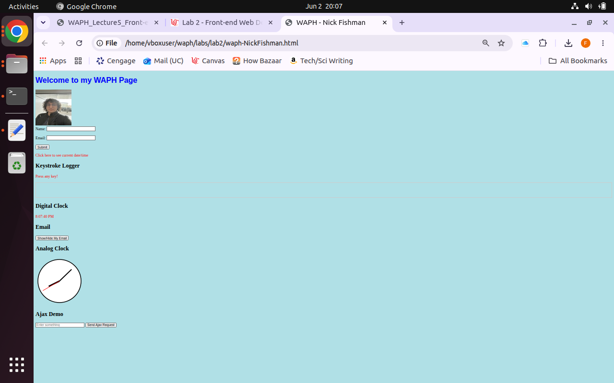
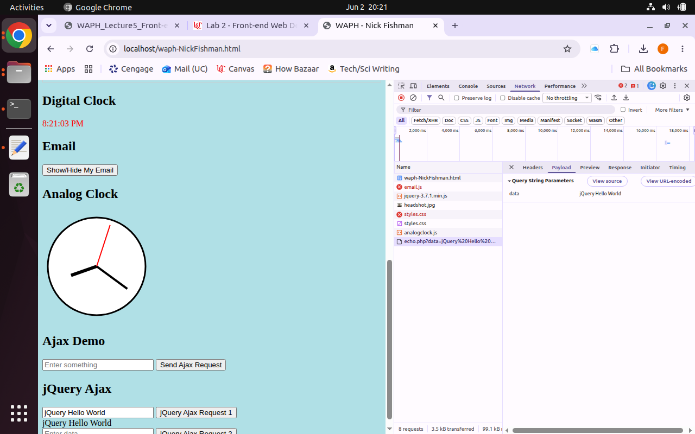
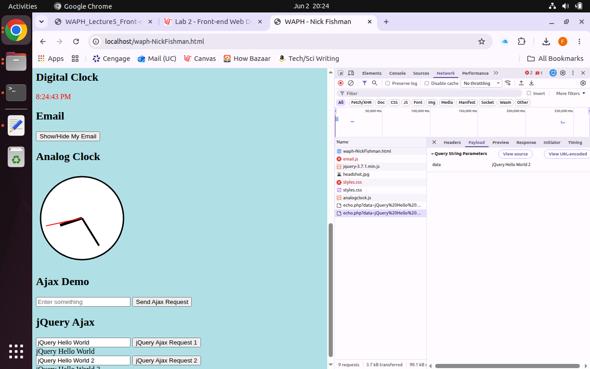
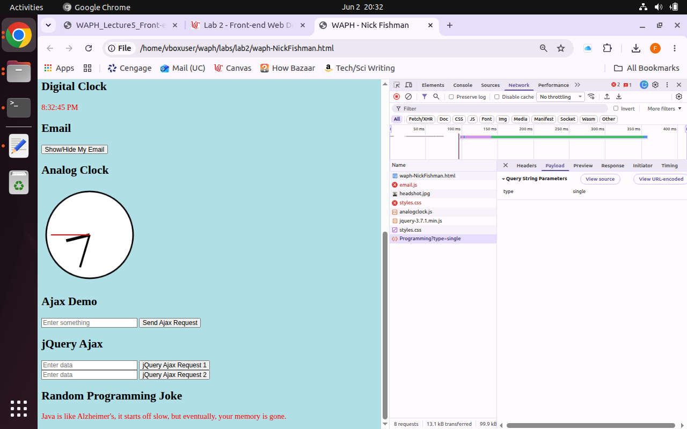
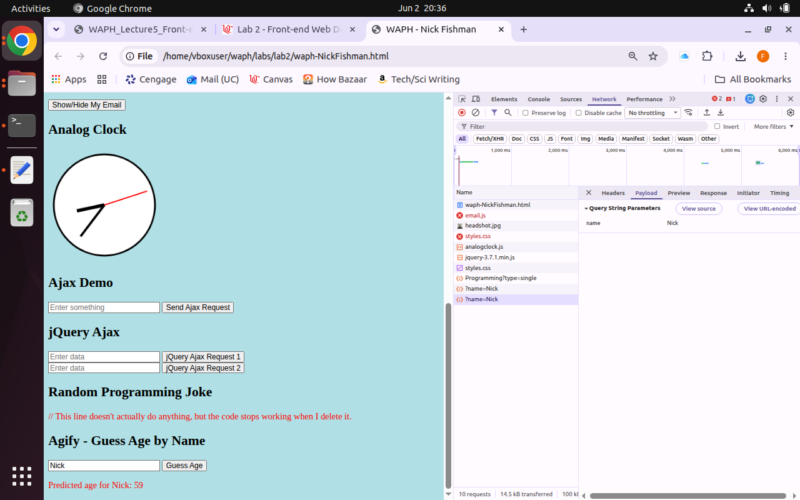

# waph

Public Respository for Web Application Programming and Hacking course - Dr. Phu Phung

# WAPH-Web Application Programming and Hacking

## Instructor: Dr. Phu Phung

## Student

**Name**: Nick Fishman

**Email**: [fishmane@mail.uc.edu](fishmane@mail.uc.edu)

**Short-bio**: Nick Fishman is an electrical engineering student with a specific interest in hardware and circuits. 

## Repository Information

Respository's URL: [https://github.com/NickFishman04/waph.git](https://github.com/NickFishman04/waph.git)

This is a private repository for Nick Fishman to store all code from the course. The organization of this repository is as follows.

### Lab 2

####Task 1: Basic HTML with forms, and JavaScript
This task is covered in Lecture 4.

a. HTML (5 pts)

b. Simple JavaScript (15 pts)

####Task 2: Ajax, CSS, jQuery, and Web API integration
Ajax, CSS, and jQuery exercises below are covered in Lecture 5; Web API integration is covered in Lecture 6.

a. Ajax (7.5 pts)

b. CSS (7.5 pts)

c. jQuery (5 pts)

d. Web API integration (10 pts)

### Labs 

[Hands-on exercises in lectures](labs) 

  - [Lab 0](labs/lab0): Development Environment Setup 
  - [Lab 1](labs/lab1): Foundations of the Web

### Hackations

Hands-on hacking exercises

### Individual Projects

### Team Project
