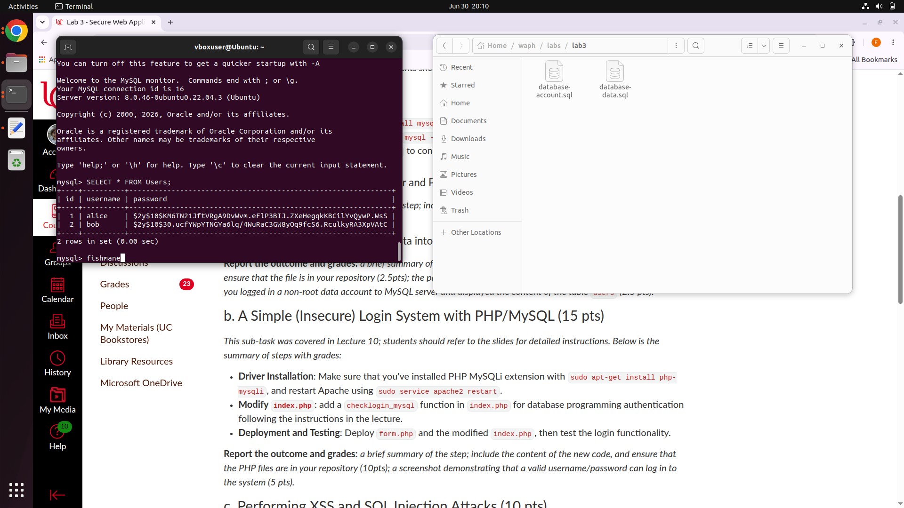
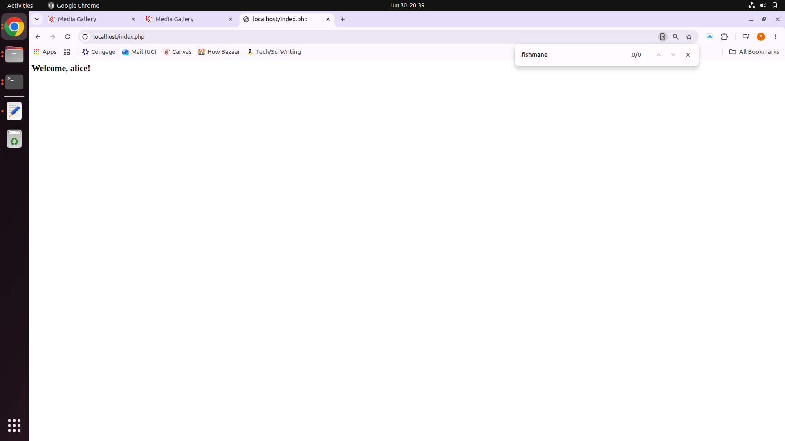
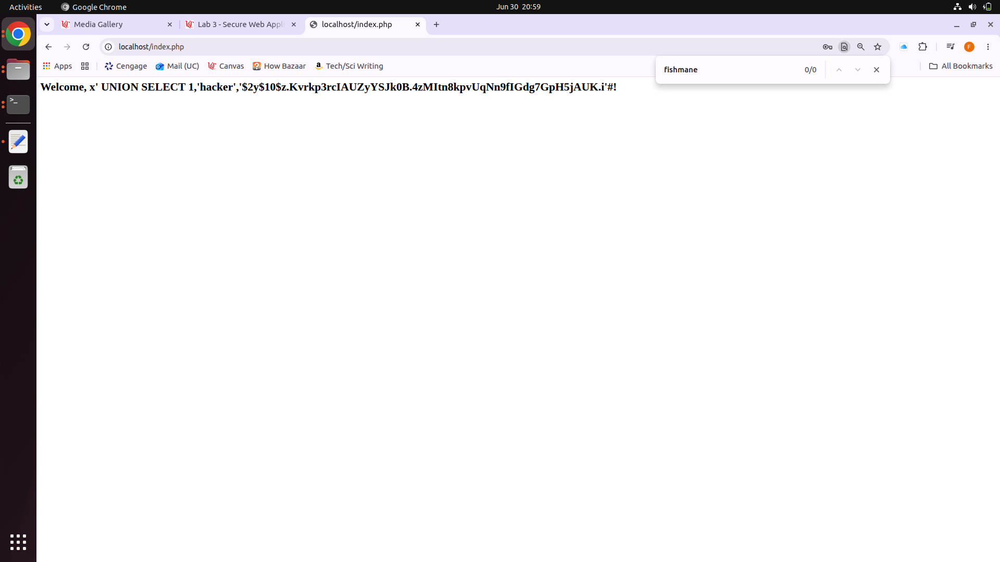
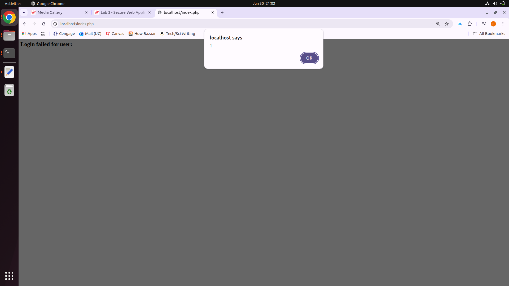

# waph

Public Respository for Web Application Programming and Hacking course - Dr. Phu Phung

# WAPH-Web Application Programming and Hacking

## Instructor: Dr. Phu Phung

## Student

**Name**: Nick Fishman

**Email**: [fishmane@mail.uc.edu](fishmane@mail.uc.edu)

**Short-bio**: Nick Fishman is an electrical engineering student with a specific interest in hardware and circuits. 


## Repository Information

Respository's URL: [https://github.com/NickFishman04/waph.git](https://github.com/NickFishman04/waph.git)

This is a private repository for Nick Fishman to store all code from the course. The organization of this repository is as follows.

## Lab 3

### Part (a): Database Setup and Management

#### Database, User, and Permissions

Created the `waph_lab3` database and a non-root user `fishmane` with privileges on it. Stored in `database-account.sql`:

```sql
CREATE DATABASE waph_lab3;
CREATE USER 'fishmane'@'localhost' IDENTIFIED BY 'password1!';
GRANT ALL PRIVILEGES ON waph_lab3.* TO 'fishmane'@'localhost';
FLUSH PRIVILEGES;
```

#### Users Table and Data

Created the `Users` table and inserted two accounts with bcrypt-hashed passwords (via PHP's `password_hash()`), so no plaintext is stored. Stored in `database-data.sql`:

```sql
USE waph_lab3;

CREATE TABLE Users (
    id INT AUTO_INCREMENT PRIMARY KEY,
    username VARCHAR(50) NOT NULL UNIQUE,
    password VARCHAR(255) NOT NULL
);

INSERT INTO Users (username, password) VALUES
('alice', '$2y$10$KM6TN21JftVRgA9DvWvm.eFlP3BIJ.ZXeHegqkKBCilYvQywP.WsS'),
('bob', '$2y$10$30.ucfYWpYTNGYa6lq/4WuRaC3GW8yOq9fcS6.RculkyRA3XpVAtC');
```

Screenshot below shows login as non-root `fishmane` and the `Users` table with hashed passwords:



### Part (b): Simple Login System with PHP/MySQL

Added `checklogin_mysql` to `index.php` so login checks the database instead of hardcoded credentials. It connects as `fishmane`, finds the username, and checks the password against the stored hash with `password_verify()`.

```php
function checklogin_mysql($username, $password) {
    $con = mysqli_connect("localhost", "fishmane", "password1!", "waph_lab3");
    if (mysqli_connect_errno()) {
        echo "DB connection failed: " . mysqli_connect_error();
        return FALSE;
    }

    $q = "SELECT * FROM Users WHERE username='$username'";
    $res = mysqli_query($con, $q);

    if ($res && mysqli_num_rows($res) > 0) {
        $row = mysqli_fetch_assoc($res);
        if (password_verify($password, $row['password'])) {
            mysqli_close($con);
            return TRUE;
        }
    }

    mysqli_close($con);
    return FALSE;
}
```

Screenshot shows a valid login as `alice`:



### Part (c): SQL Injection and XSS Attacks

#### SQL Injection

Bypassed the login without valid credentials by injecting a UNION into the username field. Since the query concatenates input directly, this appends a fake row with a password hash I generated myself:

x' UNION SELECT 1,'hacker','2y$10
z.Kvrkp3rcIAUZyYSJk0B.4zMItn8kpvUqNn9fIGdg7GpH5jAUK.i'#

Password: `hacked`

The `#` comments out the trailing quote in the original query. The UNION returns a row whose hash matches the password I chose, so `password_verify()` succeeds and login is granted.



**Why it happens:** user input is placed directly into the SQL string, so it's executed as SQL code instead of being treated as data. This lets an attacker change the meaning of the query.

#### Cross-Site Scripting (XSS)

Injected JavaScript into the username field:

<script>alert(1)</script>

The login fails, but the failure message echoes the username back into the page, so the browser runs the script and pops an alert.



**Why it happens:** user input is echoed into the HTML response without sanitization, so injected tags are rendered and executed as real markup instead of shown as plain text.


###Part d:


### Labs 

[Hands-on exercises in lectures](labs) 

  - [Lab 0](labs/lab0): Development Environment Setup 
  - [Lab 1](labs/lab1): Foundations of the Web
  - [Lab 2](labs/lab2): Front-end Web Development
  - [Lab 3](labs/lab3): Secure Web Application Development in PHP/MySQL

### Hackations

- [Hackathon 1](hackathons/hackathon1): Cross-site Scripting Attacks and Defenses 
- [Hackathon 2](hackathons/hackathon2): SQL Injection Attacks

### Individual Projects

- [Individual Project 1](projects/iproject1): Professional Profile Website and API Integration

### Team Project
