# waph

Public Repository for Web Application Programming and Hacking course - Dr. Phu Phung

# WAPH-Web Application Programming and Hacking

## Instructor: Dr. Phu Phung

## Student

**Name**: Nick Fishman

**Email**: [fishmane@mail.uc.edu](fishmane@mail.uc.edu)

**Short-bio**: Nick Fishman is an electrical engineering student with a specific interest in hardware and circuits. 

## Lab 4

### Task 1

#### Part A

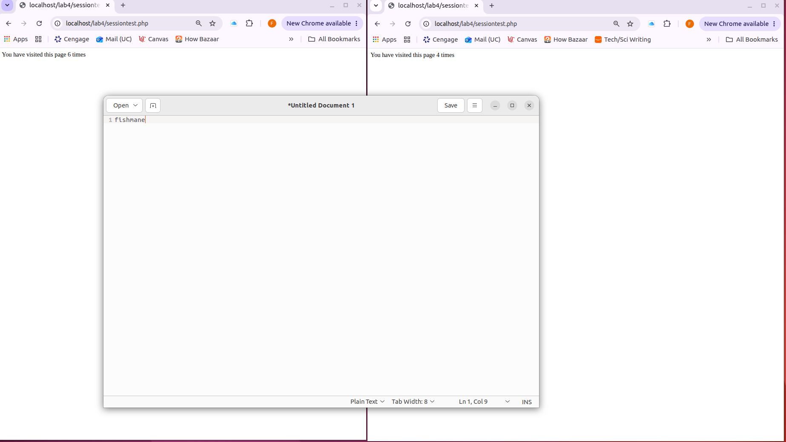

#### Part B

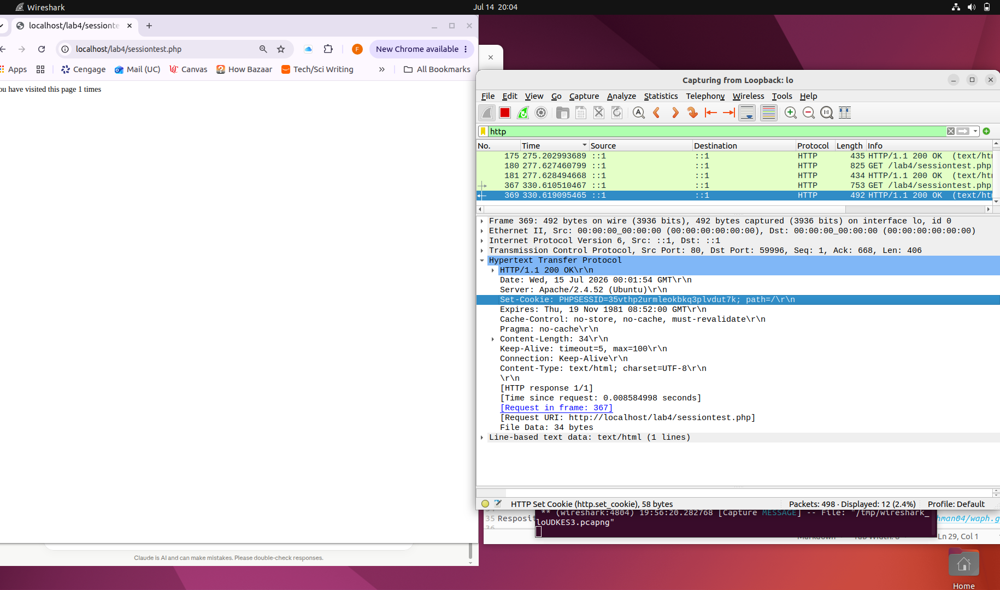

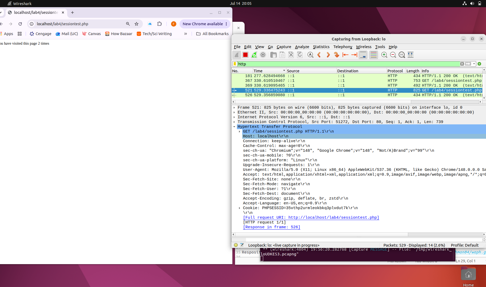

The first request has no `Cookie` header, so the server generates a session ID
and returns it via `Set-Cookie`. The browser stores it and sends it back in the
`Cookie` header on every later request, letting the stateless server re-associate
the client with its session data — which is why the view counter persists.

#### Part C
Copied the `PHPSESSID` cookie from an established session in Chrome and set it as the `PHPSESSID` cookie in Firefox, which had its own separate session.

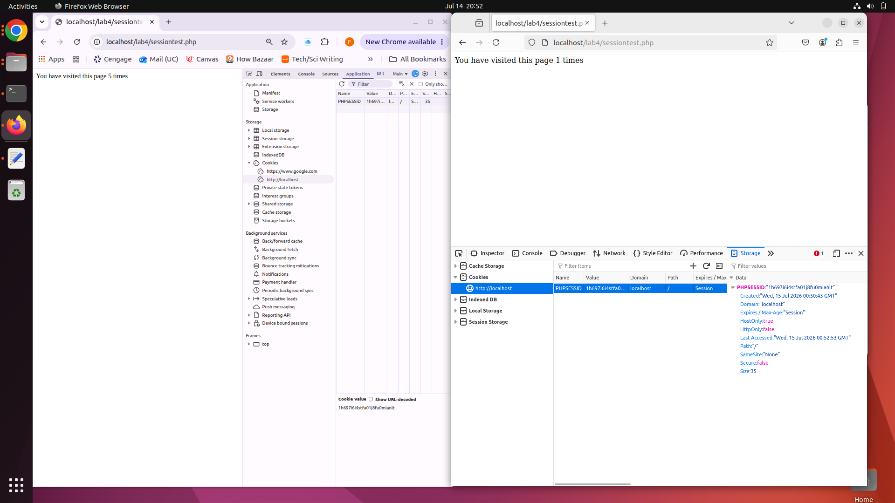

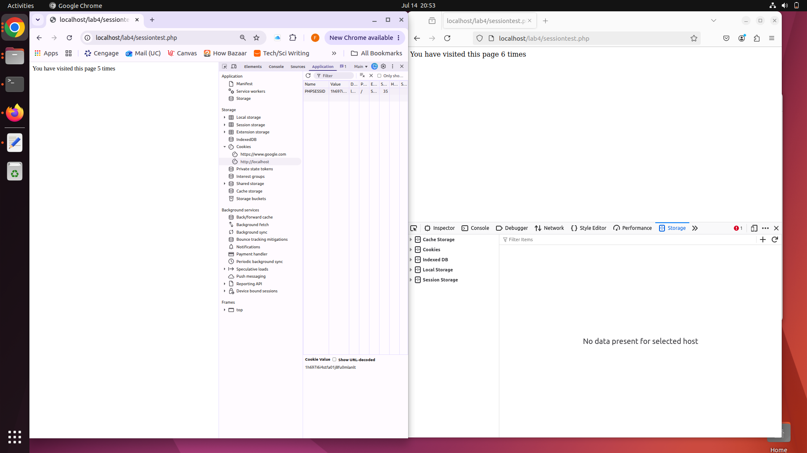

After injecting the stolen ID, Firefox continued the victim's view counter instead of starting its own, confirming it took over the session.

### Task 2

#### Part A

Added `session_start()` to Lab 3's `index.php`, stored `authenticated` and `username` in the session on successful login, and gated the protected page on the session instead of `$_POST`. `logout.php` destroys the session.

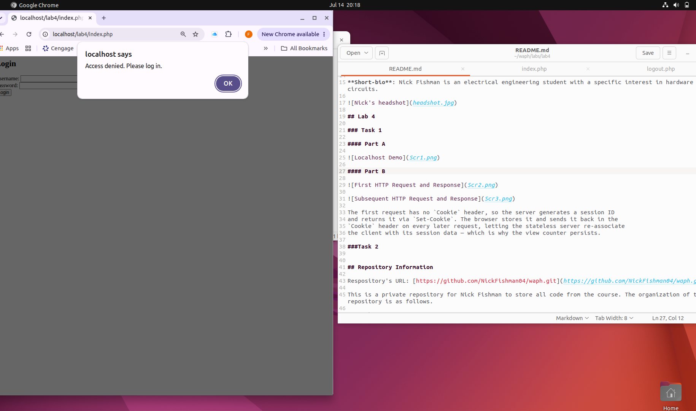

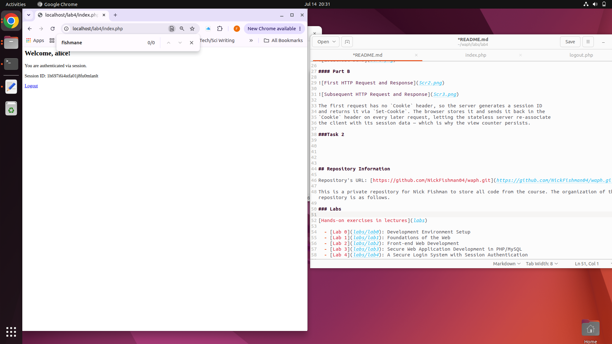

The session persists across requests, so the user stays logged in until logout.

#### Part B

Copied the `PHPSESSID` value from Chrome and manually set it as a cookie in Firefox.

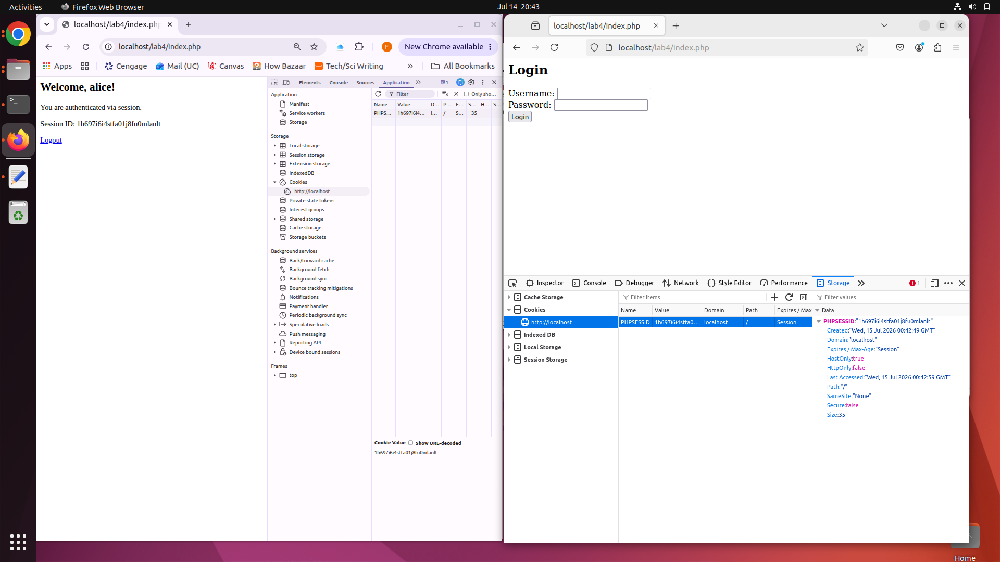

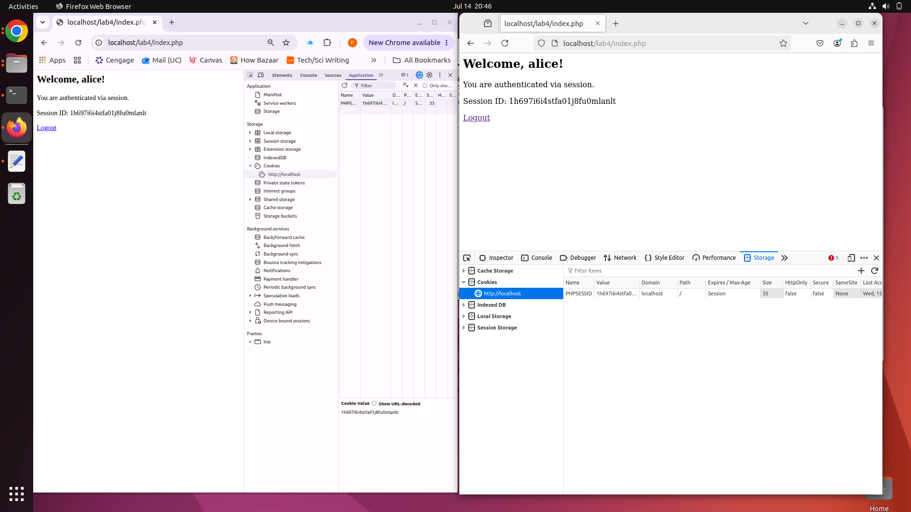

The session ID alone identifies the user, so anyone who obtains it can impersonate them.

### Task 3

#### Part A

Generated a self-signed SSL certificate with `openssl`, enabled `ssl` and `default-ssl` in Apache, and pointed `SSLCertificateFile`/`SSLCertificateKeyFile` at the new cert.

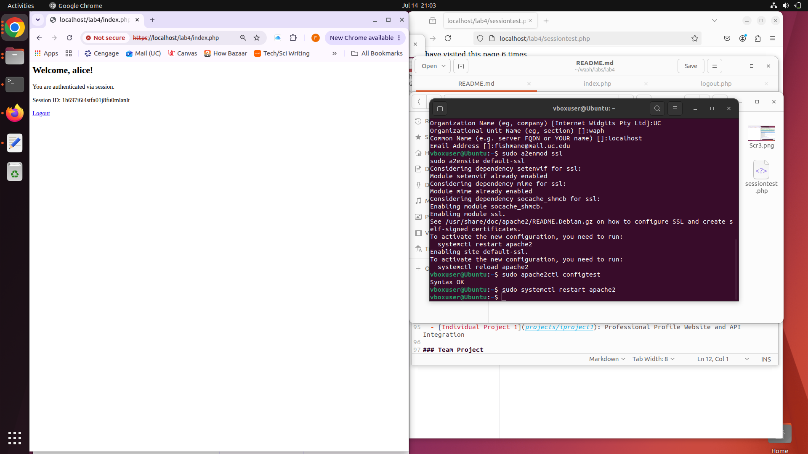

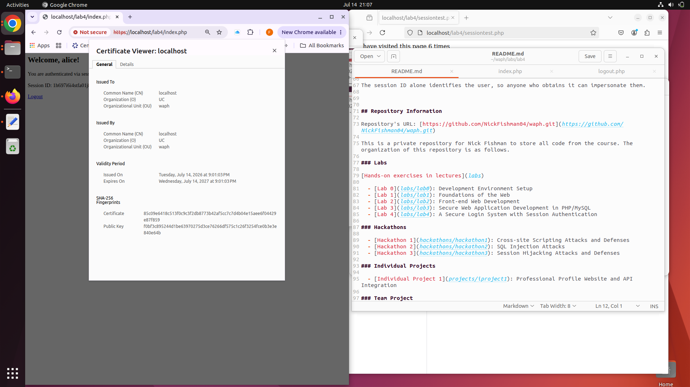

The certificate is issued to `localhost` and traffic to the lab pages is now encrypted over HTTPS instead of plaintext HTTP.

#### Part B

Added `session_set_cookie_params()` before `session_start()` to set the `Secure`, `HttpOnly`, and `SameSite=Strict` flags on the session cookie.

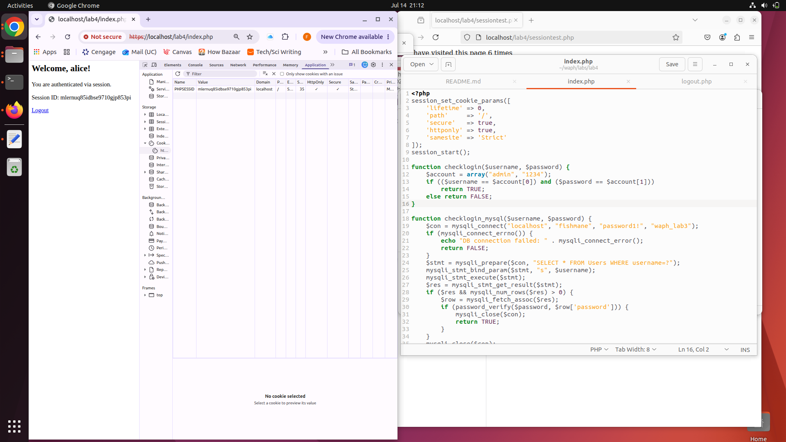

`Secure` keeps the cookie off plaintext HTTP, and `HttpOnly` blocks JavaScript from reading it, removing the XSS path to stealing the session ID.

#### Part C

After authentication, the browser's User-Agent is stored in the session and compared against the request on every protected page load. A mismatch destroys the session and redirects to the login page.

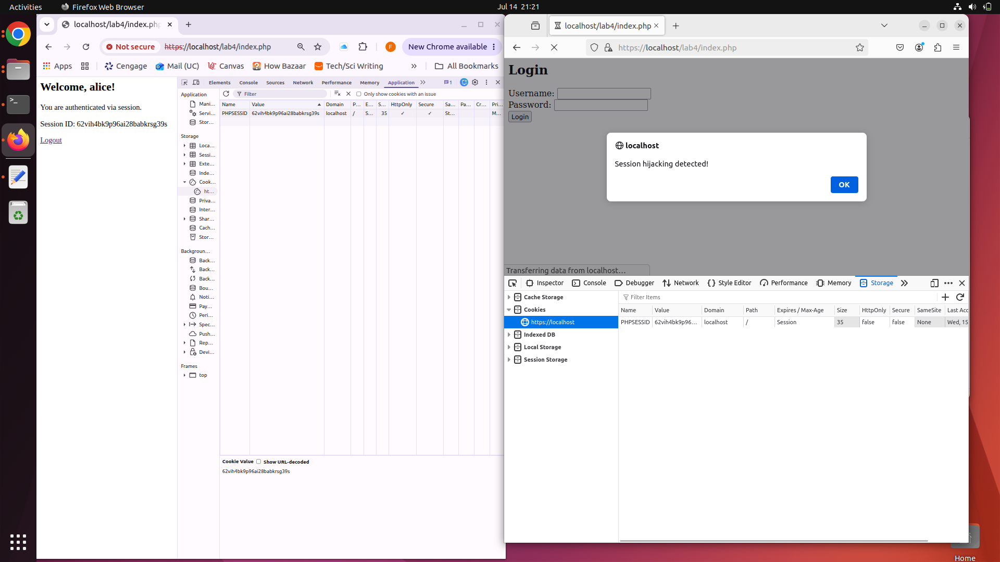

Pasting a stolen session ID into a different browser now fails, since the request's User-Agent no longer matches the one bound to the session at login.

## Repository Information

Repository's URL: [https://github.com/NickFishman04/waph.git](https://github.com/NickFishman04/waph.git)

This is a private repository for Nick Fishman to store all code from the course. The organization of this repository is as follows.

### Labs 

[Hands-on exercises in lectures](labs) 

  - [Lab 0](labs/lab0): Development Environment Setup 
  - [Lab 1](labs/lab1): Foundations of the Web
  - [Lab 2](labs/lab2): Front-end Web Development
  - [Lab 3](labs/lab3): Secure Web Application Development in PHP/MySQL
  - [Lab 4](labs/lab4): A Secure Login System with Session Authentication

### Hackathons

  - [Hackathon 1](hackathons/hackathon1): Cross-site Scripting Attacks and Defenses 
  - [Hackathon 2](hackathons/hackathon2): SQL Injection Attacks
  - [Hackathon 3](hackathons/hackathon3): Session Hijacking Attacks and Defenses

### Individual Projects

  - [Individual Project 1](projects/iproject1): Professional Profile Website and API Integration

### Team Project
